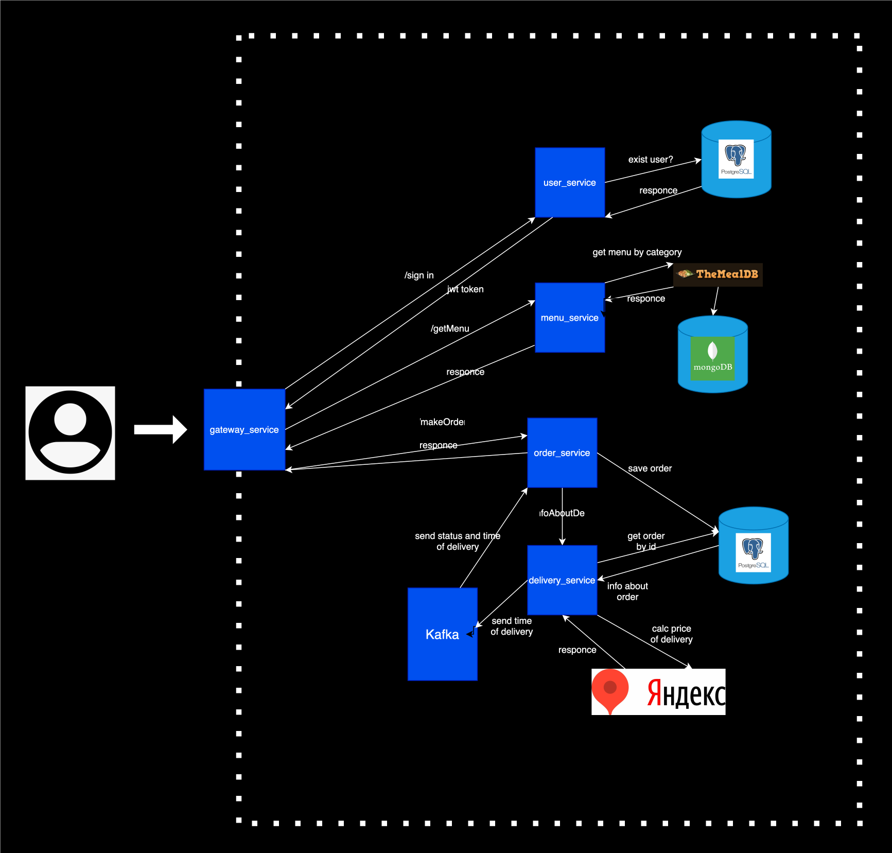

# T-Delivery
Привет! Это описание моей курсовой работы для Финтех, Java, осень 2024. Тема курсовой работы — **"Создание приложения для заказа еды с функциями доставки"**.

## Стек технологий:
- Java/Spring Boot
- Spring Cloud
- Kotlin/Ktor
- PostgreSQL
- MongoDB
- Docker
- Yandex Maps API
- The MealDB API

## Возможные сервисы:
В качестве архитектуры будут использоваться микросервисы.

### `user_service`
- **Описание**: Регистрация пользователей, авторизация, управление аккаунтами.  
- **Стек**: Java, PostgreSQL, JWT.

### `menu_service`
- **Описание**: Подтягивание данных с API, вывод на странице сайта и асинхронное сохранение в БД. Добавление новых блюд через CSV файлы.  
- **Стек**: Kotlin, MongoDB.

### `order_service`
- **Описание**: Обработка заказов, отслеживание статуса, управление корзиной и история заказов.  
- **Стек**: Java, PostgreSQL.

### `delivery_service`
- **Описание**: Helper сервис. Отправка статуса заказа через Kafka и генерирование ценообразования в зависимости от загруженности города.  
- **Стек**: Java, Kafka, API Yandex Maps.

### `gateway_service`
- **Описание**: Маршрутизатор для всех сервисов.  
- **Стек**: Java, Spring Cloud.

### `notification_service`
- **Описание**: Сервис уведомлений. Отправка уведомлений пользователям и курьерам о статусе заказов.  
- **Стек**: Java, Spring Boot, Apache Kafka, REST API, Docker.

### `courier_service`
- **Описание**: Управление курьерами. Курьеры смогут регистрироваться, получать заказы и уведомлять о статусе доставки.  
- **Стек**: Kotlin, Spring Boot, PostgreSQL, Apache Kafka, Docker.

